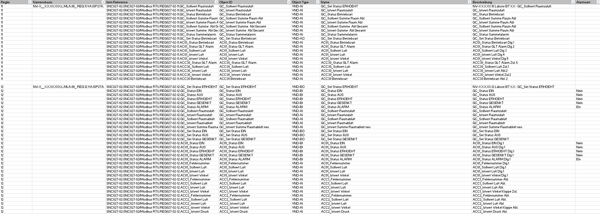
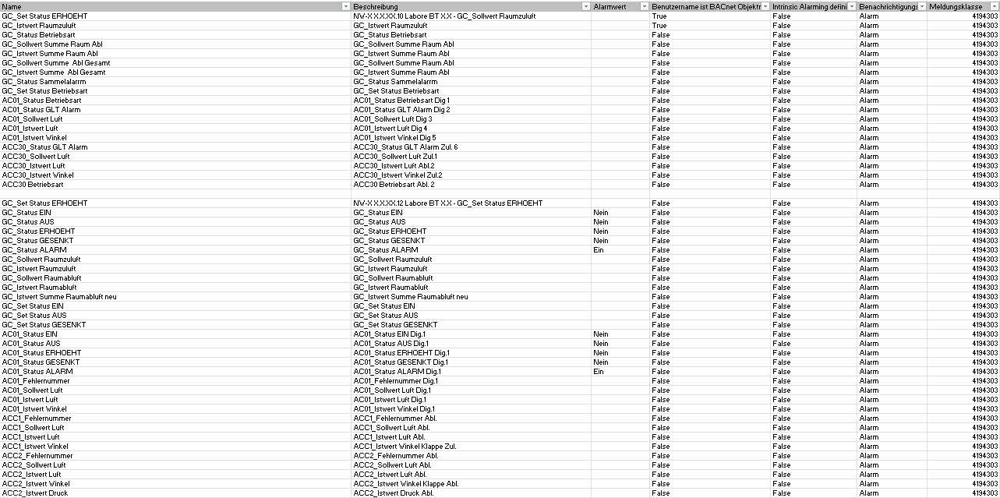
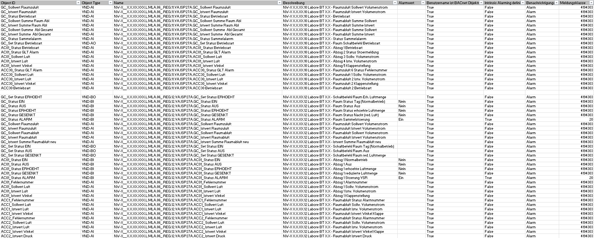

# MODBUS Datapoint Setter

The MODBUS Datapoint setter is a **project-specific Java algorithm** for mapping **Modbus raw datapoints** to predefined **customer BACnet names and values**.  

The tool is **hosted on a Raspberry Pi 5**, which is deployed within the **customer's network**, enabling direct processing of data in the local environment.

---

## 🛠️ Technologies
- **Backend:** Java, Spring Boot, Lombok, Apache POI  
- **Frontend:** Angular, TypeScript, HTML  
- **Other:** Excel file integration for automated processing  
- **Deployment:** Raspberry Pi 5 (customer network)

---

## ⚡ Key Features
- Upload Excel files through a web interface  
- Automatic processing of Modbus datapoints in the backend  
- Automatic download of the processed file after completion  
- Hosted locally on a Raspberry Pi 5 within the customer network

---

## 🖥️ How It Works
1. User uploads an Excel file with Modbus datapoints  
2. Spring Boot backend runs a Java algorithm to map and process the data  
3. Processed file is automatically running in the download folder of the users browser  

---

## 📸 Screenshots

**Before Processing – Excel File with Raw Modbus Datapoints**  

  
  

**After Processing – Excel File with Mapped BACnet Names and Values**  

  

---
